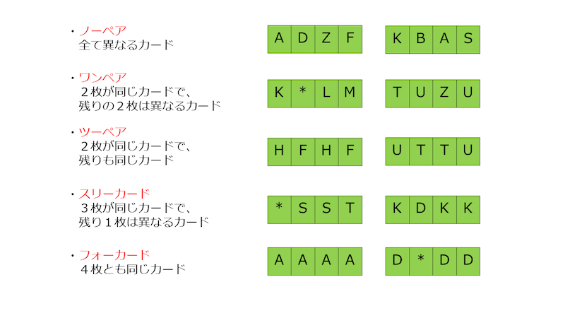

Paizaラーニングにアップロードされている問題を解きました。
この問題に対する私の回答を「cardGame.py」に記述します。
以下に問題文を記述します。
【B017:手役の強さ】

あなたはあるカードゲームを楽しんでいましたが、 ある時、いい手役ができていることに気づかず、 勝てるはずのゲームで負けていることに気づきました。
とても悔しかったあなたは、 手役を判定するプログラムを作成しようと考えています。

このゲームでは、 A から Z のアルファベット、あるいは、 「*」 が書かれたカードが４枚配られ、 この４枚を使って手役を作ります。
手役には以下のものがあります。

・ノーペア (NoPair)
・1 ペア (OnePair)
・2 ペア (TwoPair)
・3 カード (ThreeCard)
・4 カード (FourCard)

手役の強さは、下の手役の方が強く、上の手役の方が弱くなっています。
("FourCard" ＞ "ThreeCard" ＞ "TwoPair" ＞ "OnePair" ＞ "NoPair")

A から Z の他にも 「*」 が書かれたカードが配られることもあります。
このカードはワイルドカードと呼ばれ、 好きなアルファベットとして使うことができます。

配られた 4 枚のカードが入力として与えられるので、 その 4 枚でできる最も強い手役の名前を出力して下さい。

例)

入力される値
入力は以下のフォーマットで与えられます。

s
s は長さ 4 の文字列
入力値最終行の末尾に改行が１つ入ります。

期待する出力
入力された 4 枚のカードから作れる最高の手役を "FourCard"、"ThreeCard"、"TwoPair"、"OnePair"、"NoPair"の中から選び、 1 行で出力して下さい。

最後は改行し、余計な文字、空行を含んではいけません。

条件
すべてのテストケースで以下の条件を満たします。

入力されるカードの枚数は4枚です。 与えられる文字列のどの文字も、 アルファベットの大文字 A ～ Z か、 ワイルドカード * の 27 種類のいずれかです。
与えられる文字列は、 高々１つしかワイルドカード * を含みません。

入力例1
ABCD

出力例1
NoPair

入力例2
ABAB

出力例2
TwoPair

入力例3
*ZZD

出力例3

ThreeCard