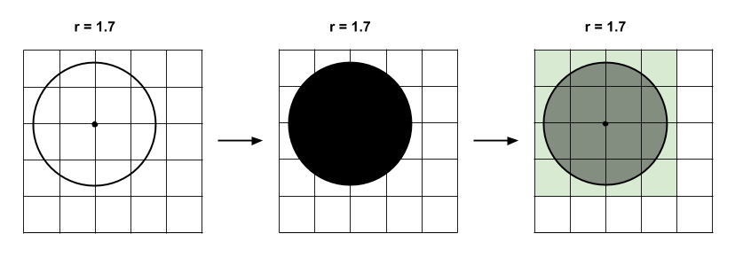

Paizaラーニングにアップロードされている問題を解きました。
この問題に対する私の回答を「movieReservation.py」に記述します。
以下に問題文を記述します。
【B024:格子を円で切り取る】

格子状に区切られた平面を考えます。各格子は一辺が長さ1 の正方形です。
平面を区切る縦線と横線が交差しできる点のうち、適当な一点を中心として半径 r の円をその平面上に描き、内部を黒で塗りつぶします。

このとき一部でも黒で塗られている格子の数を出力するプログラムを作成してください。

入力例2の図

入力は以下のフォーマットで与えられます。

r

r は円の半径

入力値最終行の末尾に改行が１つ入ります。
文字列は標準入力から渡されます。

期待する出力
黒で塗られる格子の数を一行に出力してください。

最後は改行し、余計な文字、空行を含んではいけません。

条件
すべてのテストケースで以下の条件を満たします。

・1 ≦ r ≦ 1000

r は0.00001 刻みで与えられる

入力例1
1

出力例1
4

入力例2
1.7

出力例2
16

入力例3
100.02651

出力例3
31852